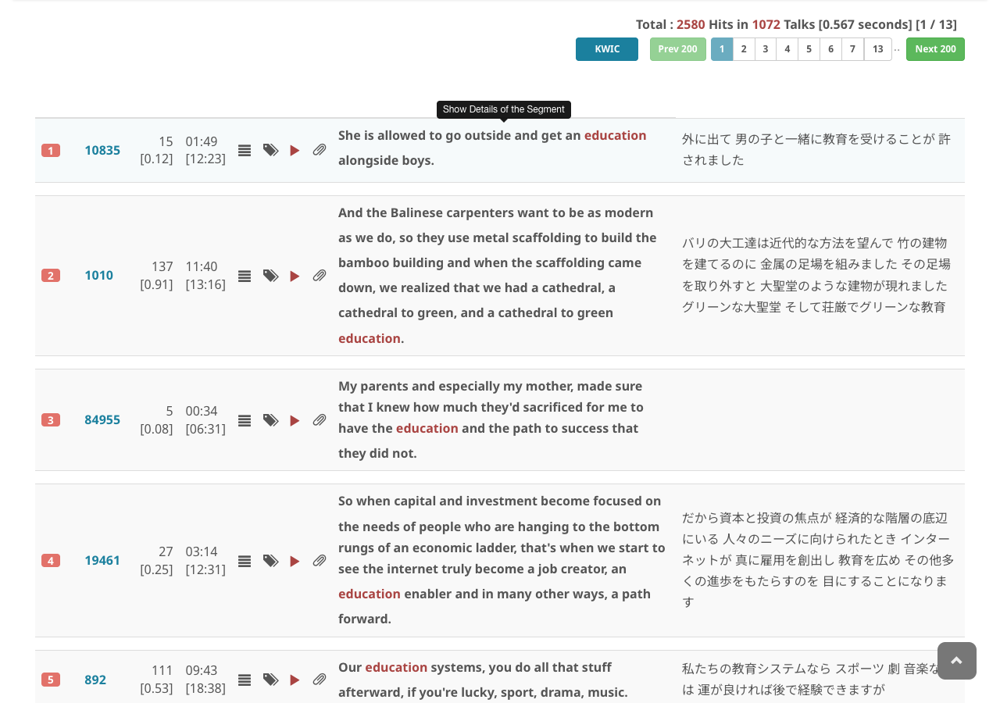
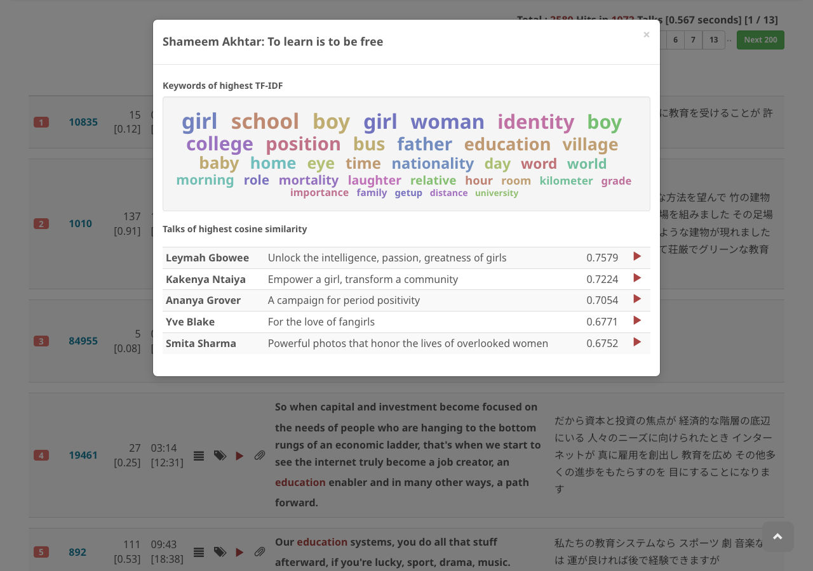
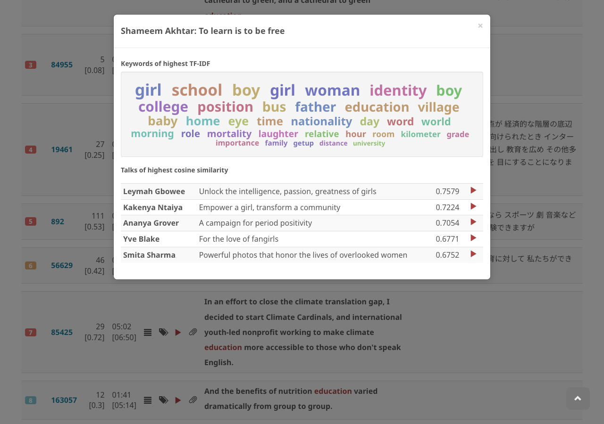

# Find talks of similar topics

Choose a talk and click the **keywords** icon to show the keywords panel.

Listed on the lower part of the keywords panel are talks that have similar keywords and topics as the talk you have chosen. Similarity is computed based on keyword overlap using TF-IDF scores.

