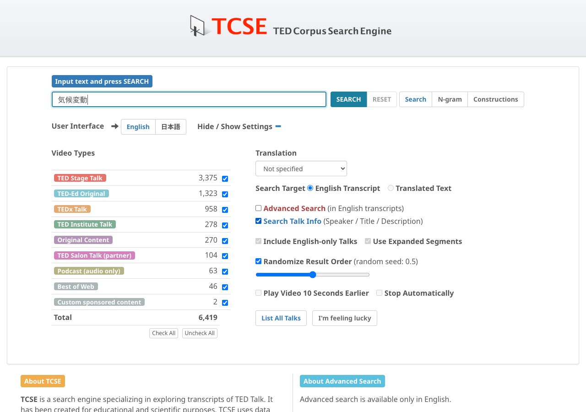
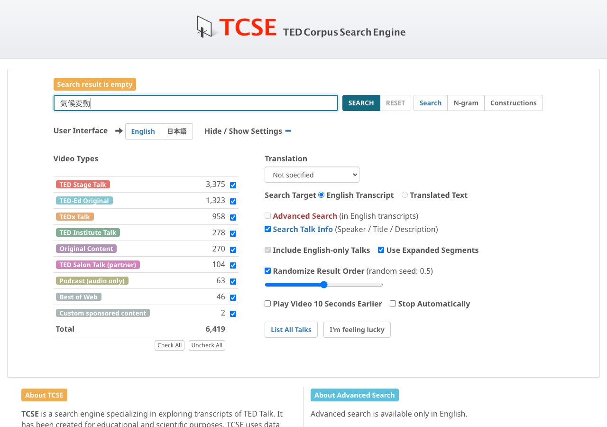

# Search in talk information in translated language

To search in translated text of titles, speaker names, descriptions, and keywords of talks:

1. Choose a **Translation** language
2. Set **Search Target** to **Translated Text**
3. Check **Search Talk Info**
4. Click on **SEARCH**

