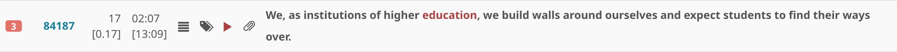
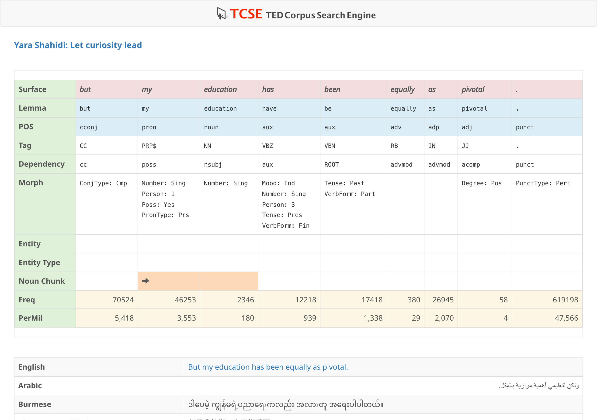

# Check syntactic information

Click on the segment text in search results to open a syntactic information panel.

All transcript data in TCSE is annotated with linguistic analysis using [spaCy](https://spacy.io/) 3.8 (`en_core_web_lg`). The following information is available for each token:

| Field | Description |
| :--- | :--- |
| **Surface** | The original word form as it appears in the text |
| **Lemma** | The base/dictionary form of the word |
| **POS** | Part-of-speech tag (coarse: NOUN, VERB, ADJ, etc.) |
| **Tag** | Fine-grained POS tag (NN, VBZ, JJ, etc.) |
| **Dep** | Syntactic dependency relation (nsubj, dobj, prep, etc.) |
| **Morph** | Morphological features (Number, Tense, Voice, etc.) |
| **Entity** | Named entity type, if applicable (PERSON, ORG, GPE, etc.) |
| **Noun Chunk** | Whether the token is part of a noun chunk |
| **Frequency** | Frequency of the word in the corpus |

{ width="600" }

