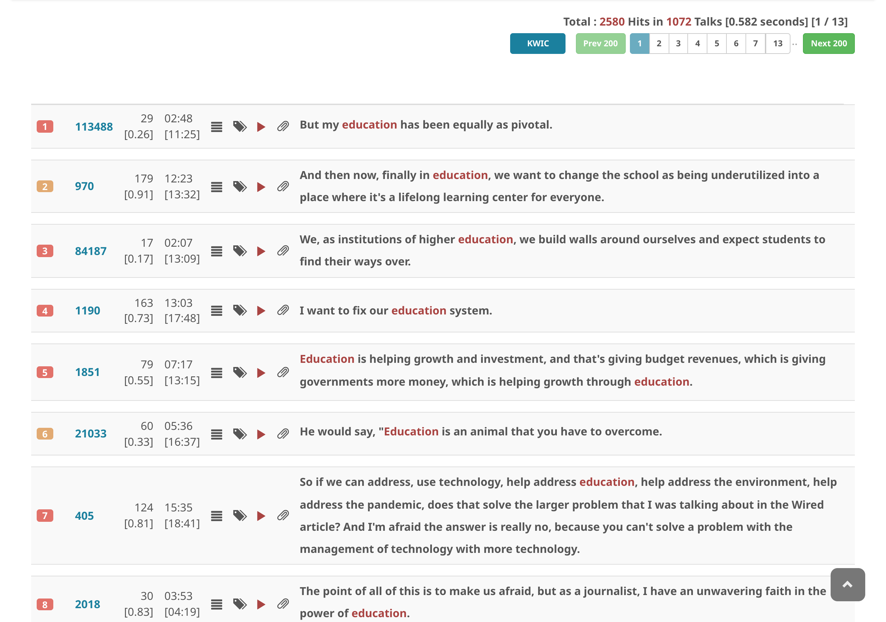
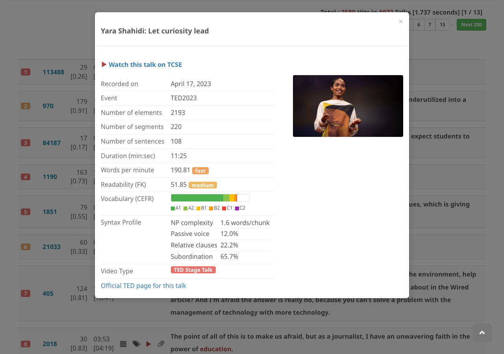

# Find basic information about a talk

In search results, click the **talk ID number** to open the talk information modal. (In talk search results, clicking the speaker name or title also opens the modal.)

The talk information modal includes:

- Talk title (English and translation if available)
- **Watch this talk on TCSE** link
- Thumbnail image
- **Recorded on** date
- **Event** name (e.g. TEDWomen 2017)
- **Number of elements** (tokens)
- **Number of segments**
- **Number of sentences**
- **Duration** (min:sec)
- **Words per minute** with speed indicator (very slow / slow / moderate / fast / very fast)
- **Readability (FK)** Flesch-Kincaid score with difficulty indicator
- **Vocabulary (CEFR)** distribution bar (A1–C2)
- **Syntax Profile**: NP complexity, passive voice ratio, relative clauses ratio, subordination ratio
- **Video Type** (e.g. TED Stage Talk, TED-Ed Original)
- **Official TED page** link
- **Speaker information from Wikipedia** (when available): name, date of birth, sex or gender, country of citizenship, occupation, description
- **Synopsis**: talk description in English and translation (if available)
