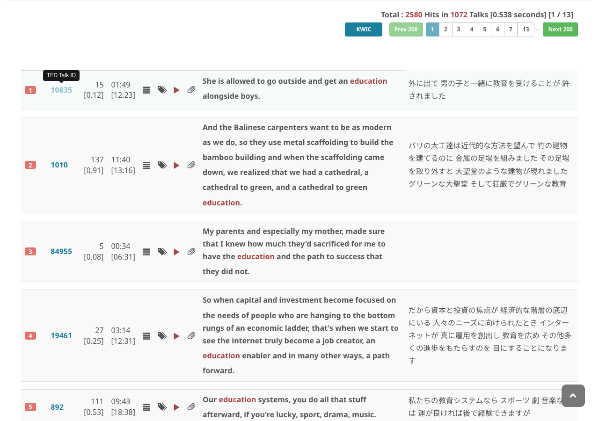
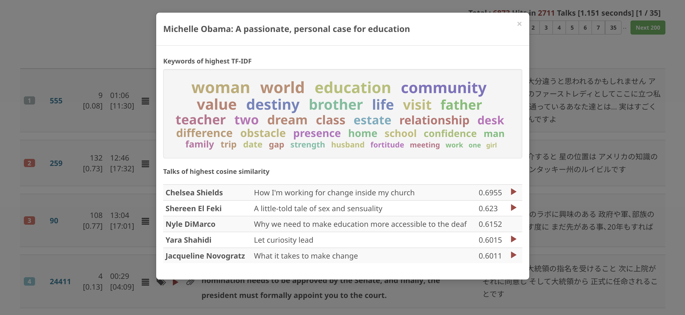

# Show keywords of a talk

1. Choose a talk
2. Click the **keywords** icon
3. The upper part of the panel shows keywords extracted based on TF-IDF of all the content words of the talk
4. The lower part shows **similar talks** — talks that share similar keywords and topics

See also: [Find talks of similar topics](../finding-talks/find-talks-of-similar-topics.md)
