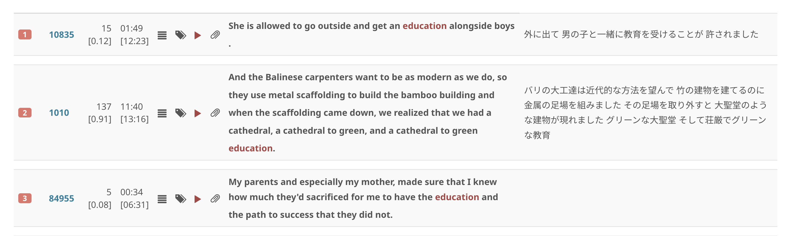
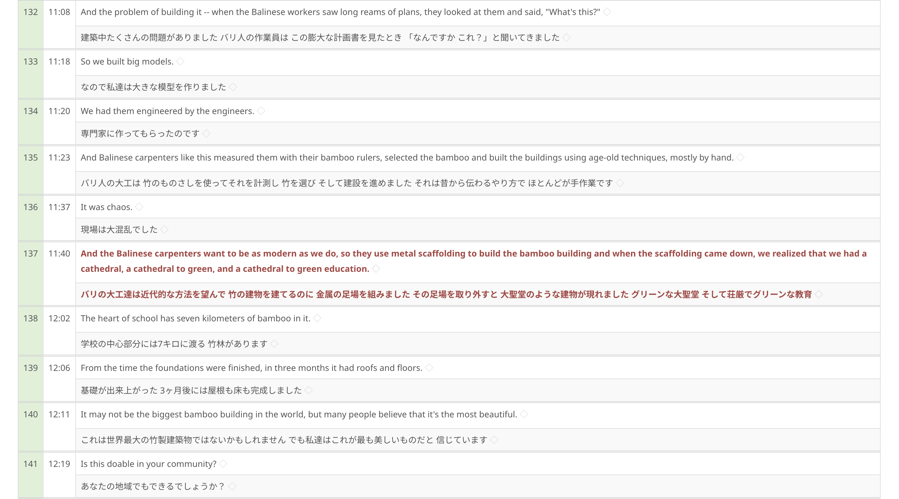

# Show transcripts in full-length

1. Choose a talk
2. Click on the **list-items** icon

The full transcript view supports [text highlighting](text-highlight.md) for keywords and discourse markers, which can help you quickly identify key concepts and structural elements of the talk.
