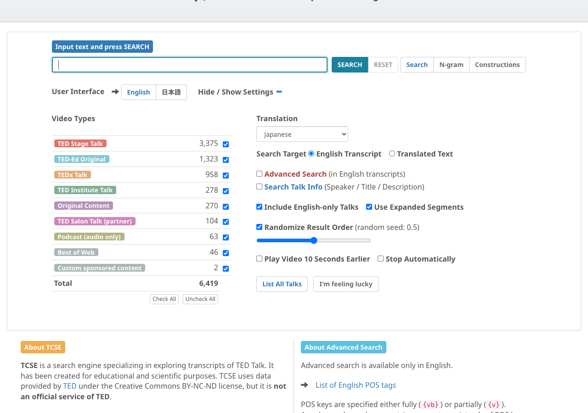
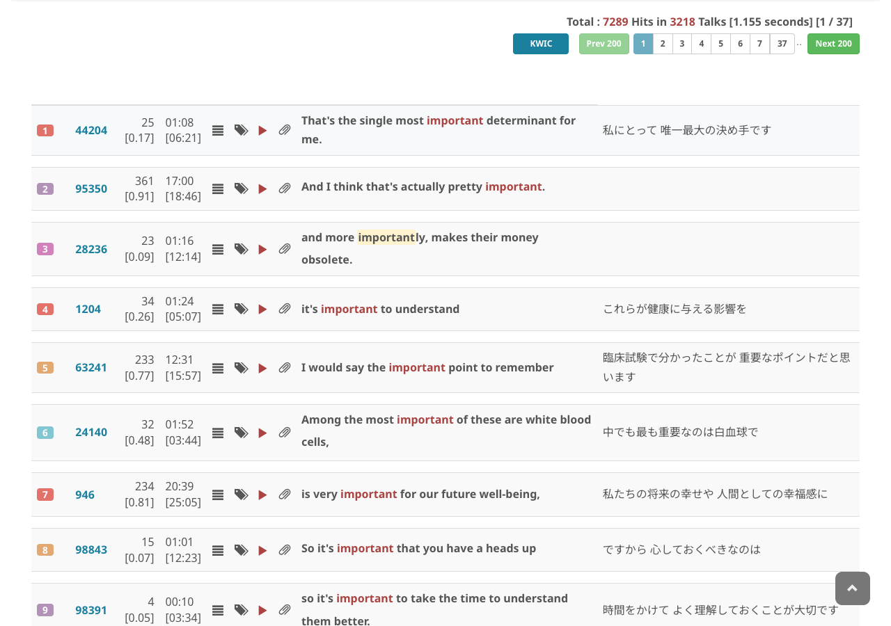
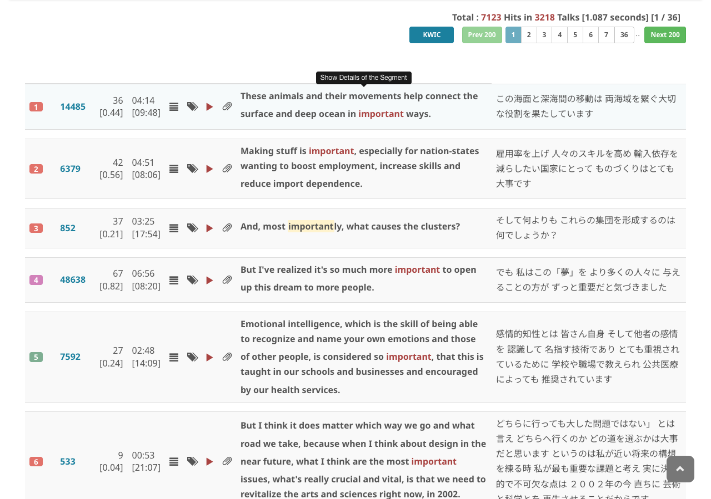

# 拡張セグメントモードに切り替える

**拡張セグメント**は、1つ以上のセグメントを結合して、少なくとも1つの完全な文を含むようにした単位です。一方、**通常セグメント**は文の断片となる場合があります。

TCSE v12.0.0 では、**拡張セグメントがデフォルト**で使用されます。各検索結果がより自然で完全な文脈で表示されるためです。

モードを切り替えるには、新しい検索を行う前に **Use Expanded Segments** のチェックを入れるか外します。

**通常セグメントモード**

**拡張セグメントモード**

