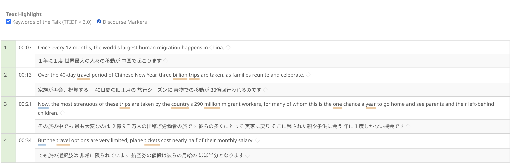

# Text highlight

When viewing full-length transcripts, TCSE can highlight important words and phrases to help you identify key content and discourse structure at a glance.

## Highlight modes

Highlighting is **off by default** to keep the transcript view clean. Use the checkboxes at the top of the full transcript view to enable highlighting:

### Keywords

Highlights content words with high TF-IDF scores (> 3.0) for the current talk. These are words that are statistically significant in the talk compared to the overall corpus, helping you quickly identify the talk's key topics and terminology.

### Discourse Markers

Highlights discourse markers — words and phrases that signal the structure and flow of the talk (e.g., transitions, hedges, emphasis markers). This is useful for studying how speakers organize their presentations.

!!! tip "Tips"
    - Highlighting is off by default — check the boxes to enable
    - Keywords and discourse markers can be highlighted simultaneously
    - Highlighting is available in both normal and expanded segment modes
    - The highlight colors help distinguish between keywords and discourse markers
