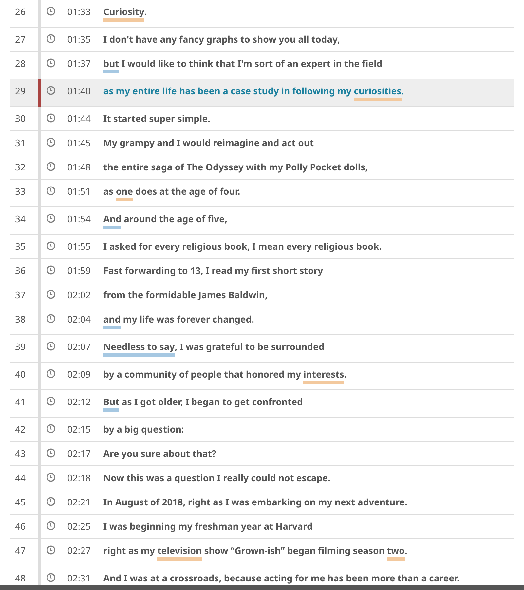
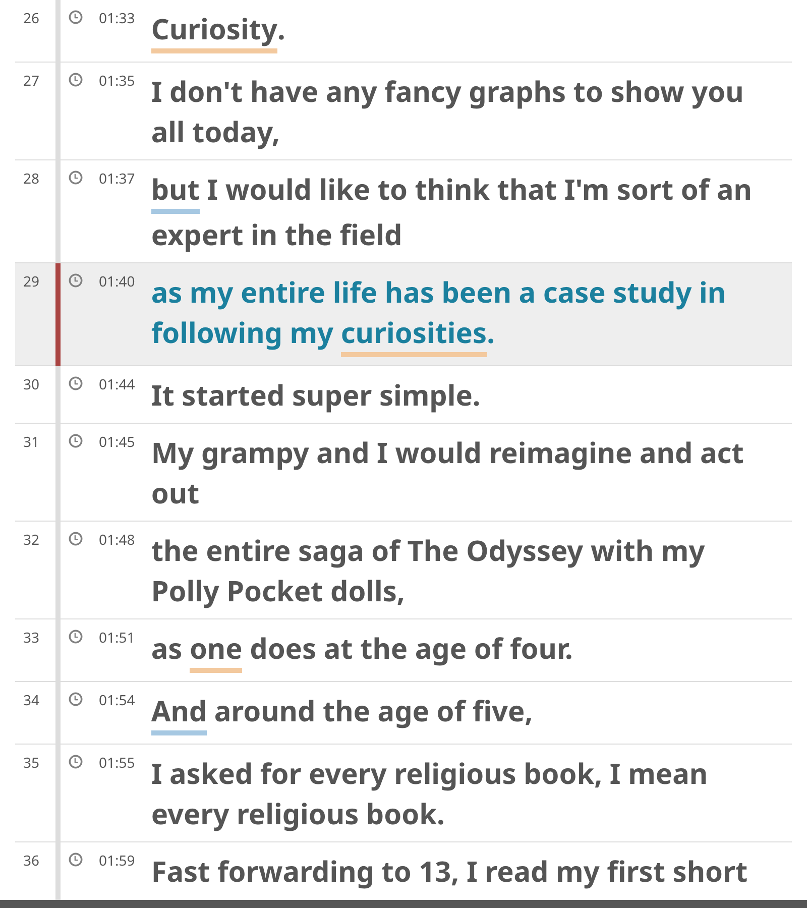
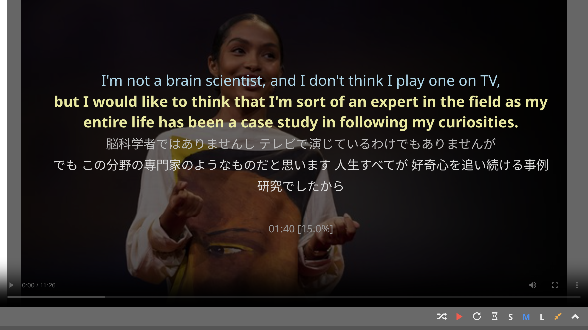
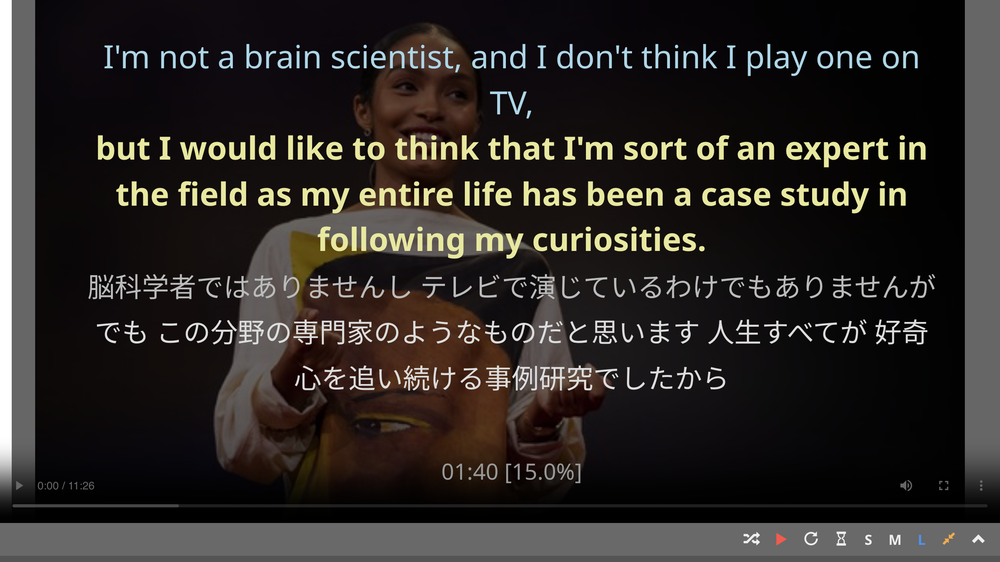

# Change font size of transcript text

Click on `S`, `M`, `L` buttons on the video controller or use corresponding keyboard shortcuts (`S`, `M`, `L` respectively) to change the font size of transcript text. The font size applies to both normal viewing mode and fullscreen viewing mode.

**Font small (normal viewing mode)**

{ width="600" }

**Font medium (normal viewing mode)**

{ width="600" }

**Font small (fullscreen viewing mode)**

**Font medium (fullscreen viewing mode)**

**Font large (fullscreen viewing mode)**

