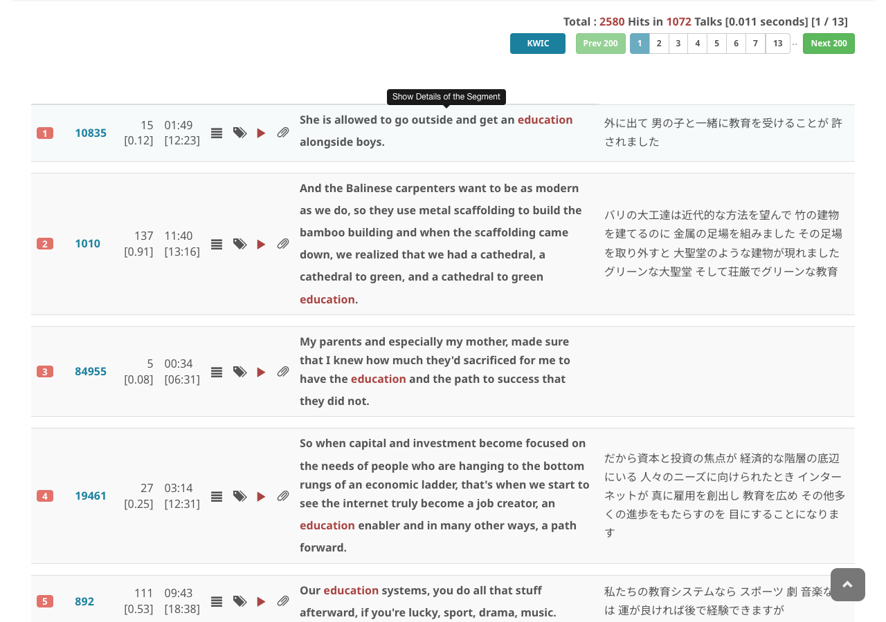

# Fine-tune sync between video and transcript

Sometimes video and transcript are not in sync. In such cases, try the following:

1. Pause the video
2. Locate the segment that is expected to be played when the video is resumed
3. Click on the **adjust** button corresponding to the segment

The video and text will then be in sync.
