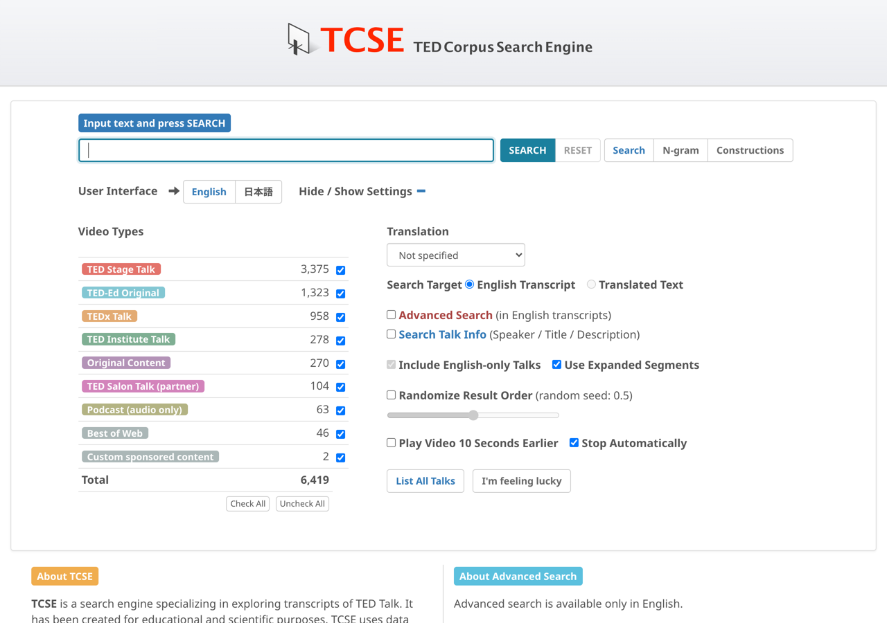

# セグメント後にビデオを一時停止する

検索を行う前に **Stop automatically** にチェックを入れる（またはスタディモードの `A` キーを押す）と、各セグメントの再生が終わるたびにビデオが自動的に一時停止します。自分のペースで内容を確認できます。

これは語学学習に特に役立ちます。詳しくは[一時停止して確認](../using-tcse-for-language-learning-and-education/using-pause-and-check.md)を参照してください。
