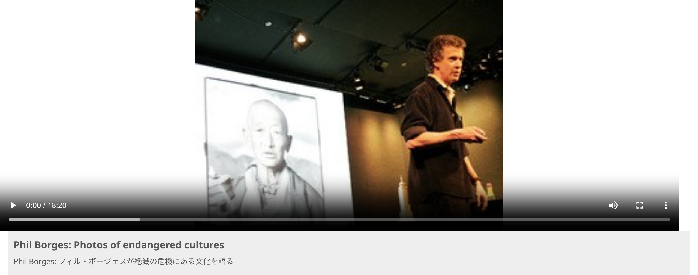
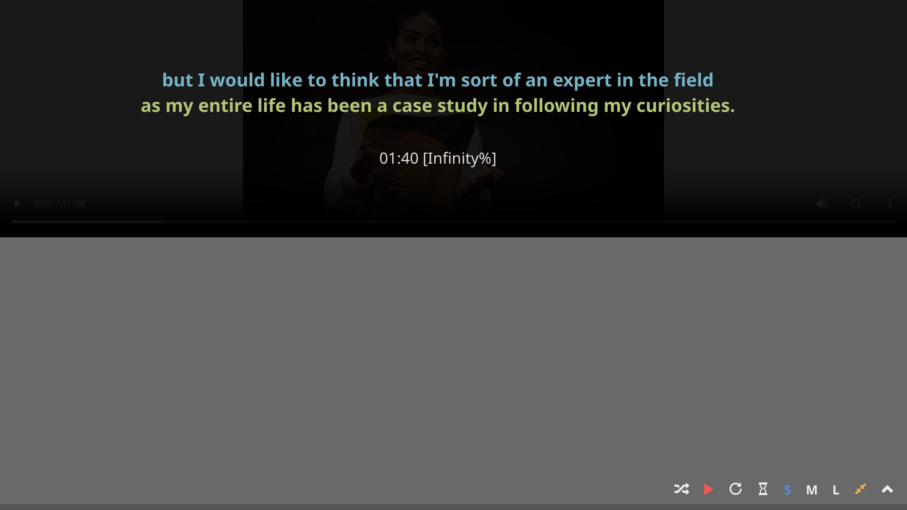

# フルスクリーンモードに切り替える

ビデオ再生中に **fullscreen** アイコンをクリックするか、`ESC`、`E`、`B` キーを押すと、通常表示モードとフルスクリーンモードを切り替えられます。

フルスクリーンモードでは、トランスクリプト（と翻訳テキスト）はビデオが一時停止されたときだけ表示されます。これは英語のリスニングスキルを鍛えるためにTEDビデオを視聴する人に大いに役立ちます。詳しくは[一時停止して確認](../using-tcse-for-language-learning-and-education/using-pause-and-check.md)を参照してください。

{ width="600" }

**通常表示モード**

**フルスクリーン表示モード**

フルスクリーンモードで一時停止すると、現在のセグメントのテキストが**黄色**で、1つ前のセグメントのテキストが**シアン**で表示されます。翻訳テキストが選択されている場合は、その下に翻訳も表示されます。画面下部にはタイムスタンプと相対位置が表示されます。
