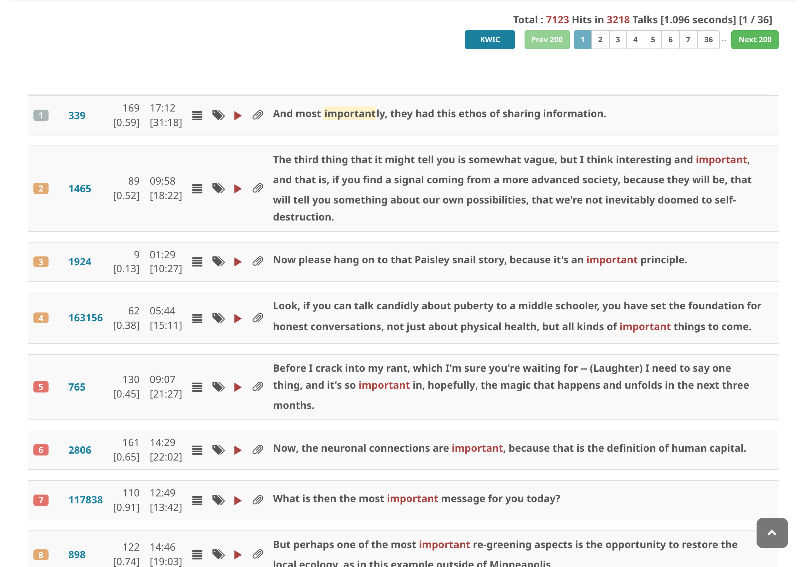
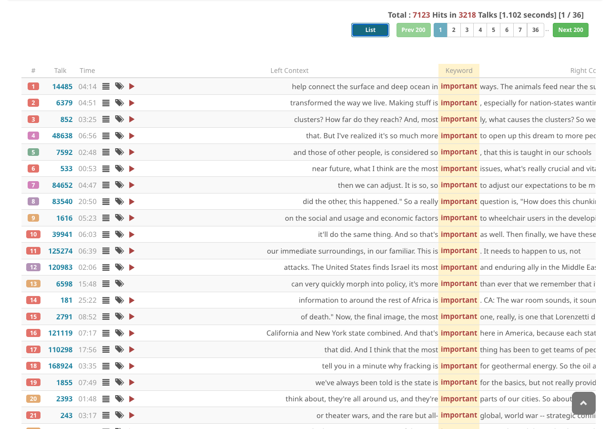

# KWIC コンコーダンス表示

KWIC（Key Word In Context）は、コーパス言語学で広く使用されるコンコーダンス表示形式です。各検索結果のキーワードを中央に配置し、その左右の文脈を表示します。

## リスト表示とKWIC表示の切り替え

検索実行後、**KWIC** ボタンをクリックすると、デフォルトのリスト表示からKWICコンコーダンス表示に切り替わります。**List** をクリックするとリスト表示に戻ります。

## KWIC表示の形式

KWIC表示では、結果が3列のテーブルで表示されます：

| 列 | 内容 |
| :--- | :--- |
| **左文脈** | キーワードの前にある語（右寄せ） |
| **キーワード** | マッチした検索語（中央配置、ハイライト） |
| **右文脈** | キーワードの後にある語（左寄せ） |

各行には、セグメントを文脈で表示するアイコンやビデオ再生アイコンも含まれます。

## コンパクト表示

検索クエリが4語以上の場合、またはマッチしたキーワードが4語以上にわたる場合、キーワード列にはキーワード全体の代わりにコンパクトなプレースホルダーマーカー（`···`）が表示されます。マーカーにカーソルを合わせるとマッチしたキーワードが表示され、クリックするとセグメント詳細ビューが開きます。

## ヒント

- KWIC表示はすべての検索タイプ（通常検索・アドバンスト・サーチ）で利用可能
- ページ移動はリスト表示と同じ方法で操作可能
- リスト表示とKWIC表示の切り替えでは、新しい検索は実行されない
