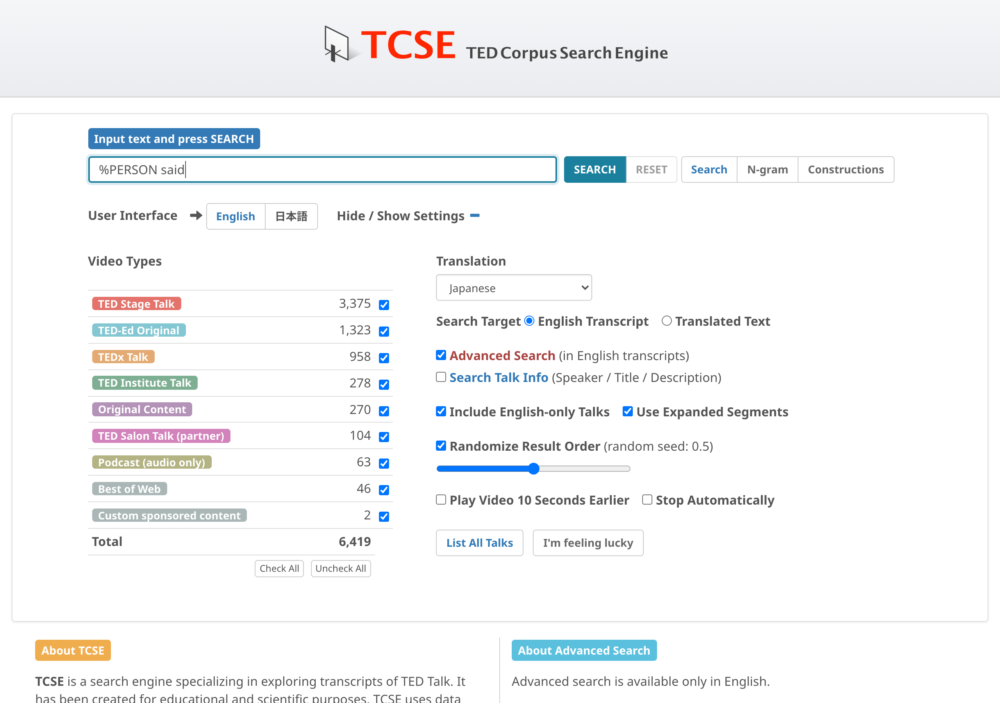
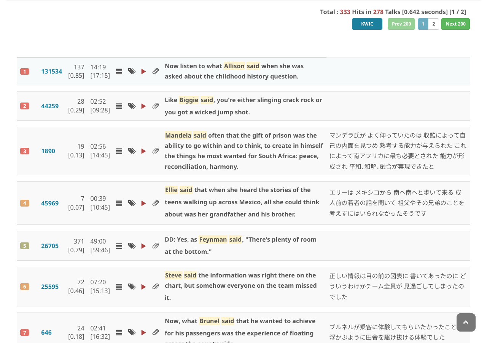

# Named entity search

TCSE supports searching for named entities recognized by spaCy's NER (Named Entity Recognition) system. Use the `%ENTITY` notation in advanced search mode to find specific types of named entities in TED Talk transcripts. Multi-token entities (e.g. "New York", "United Nations") are matched as a single unit.

## How to use

1. Enter a query using the `%ENTITY` notation (e.g., `%PERSON said`)
2. Check **Advanced Search**
3. Click **SEARCH**

## NER patterns in N-gram mode

You can also search for NER patterns in the **N-gram** mode. For example, searching `%PERSON` in 1-gram mode shows the total frequency of person entities across the corpus. Searching in 2-gram or higher modes reveals common patterns involving named entities (e.g., `%PERSON said`, `in %GPE`). Clicking on an N-gram result will automatically open the corresponding advanced search.

## Entity types

TCSE recognizes 18 named entity types:

| Entity Type | Description | Count in Corpus |
| :--- | :--- | ---: |
| `%CARDINAL` | Numerals that do not fall under another type | 73,912 |
| `%DATE` | Absolute or relative dates or periods | 72,487 |
| `%PERSON` | People, including fictional | 59,525 |
| `%GPE` | Countries, cities, states | 48,806 |
| `%ORG` | Companies, agencies, institutions, etc. | 47,748 |
| `%ORDINAL` | "first", "second", etc. | 21,850 |
| `%NORP` | Nationalities or religious or political groups | 21,830 |
| `%LOC` | Non-GPE locations, mountain ranges, bodies of water | 14,512 |
| `%TIME` | Times smaller than a day | 9,389 |
| `%PERCENT` | Percentage, including "%" | 8,184 |
| `%QUANTITY` | Measurements, as of weight or distance | 6,854 |
| `%WORK_OF_ART` | Titles of books, songs, etc. | 6,046 |
| `%MONEY` | Monetary values, including unit | 5,108 |
| `%PRODUCT` | Objects, vehicles, foods, etc. (not services) | 3,470 |
| `%FAC` | Buildings, airports, highways, bridges, etc. | 2,649 |
| `%EVENT` | Named hurricanes, battles, wars, sports events, etc. | 2,165 |
| `%LANGUAGE` | Any named language | 1,557 |
| `%LAW` | Named documents made into laws | 758 |

## Examples

| Query | What it finds |
| :--- | :--- |
| `%PERSON` | All person names |
| `%PERSON said` | Person names followed by "said" |
| `in %GPE` | "in" followed by a country/city name |
| `%MONEY` | All monetary expressions |
| `%DATE` | All date expressions |
| `%ORG [be]` | Organization names followed by forms of "be" |
