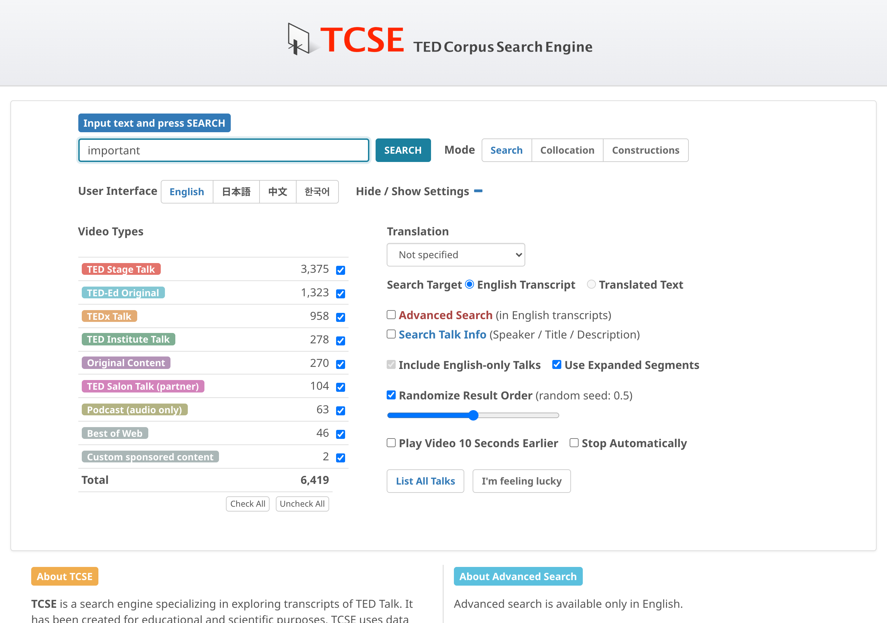
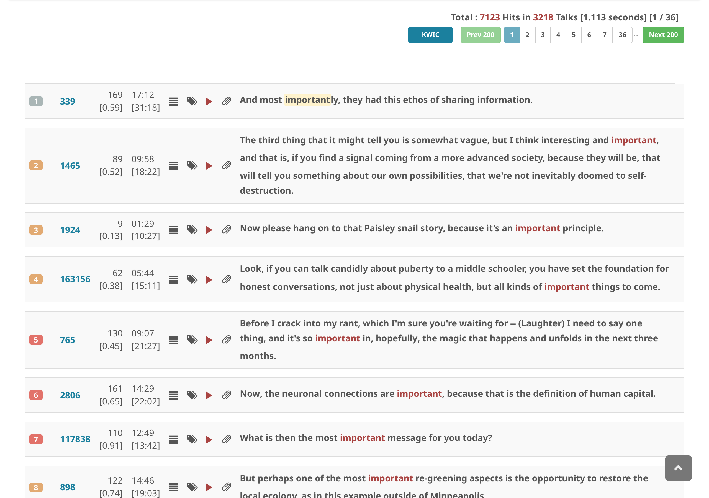

# トランスクリプトを検索する

1. 検索文字列を入力する
2. **SEARCH** をクリックする

TCSEでは、トランスクリプトは**セグメント**と呼ばれる単位に分割されています。セグメントとは、TED Talksの字幕表示における1画面分のテキストに相当します。1つのセグメントは通常1〜3文程度で構成されますが、文の途中で区切られることもあります。

デフォルトでは、TCSEは**拡張セグメント**を使用します。拡張セグメントは、セグメントの境界を文単位で再調整したもので、少なくとも1つの完全な文を含みます。これにより、各検索結果がより自然な文脈で表示されます。

結果はページ番号ボタンでページ分けされ、結果エリアの上部と下部に表示されます。**Prev** と **Next** ボタン、または特定のページ番号をクリックして移動できます。

[KWIC コンコーダンス表示](kwic-concordance-view.md)に切り替えて、コンパクトで言語学的な分析に適した形式で結果を表示することもできます。

## ワイルドカード検索

通常検索モード（アドバンスト・サーチをオフにした状態）でも、`*` をワイルドカードとして使用できます。たとえば `take * granted` と検索すると、*take it for granted*、*take that for granted* などのフレーズがヒットします。

## 結果のランダマイズ

デフォルトでは、検索結果はランダムな順序で表示されます。これにより、毎回同じトークが上位に表示されるのではなく、さまざまなトークを閲覧できます。

設定パネルでこの動作を制御できます：

- **Randomize Result Order** チェックボックス：チェックを外すと、デフォルトのデータベース順で結果が表示されます。
- **Random seed** スライダー：ランダマイズが有効な場合、スライダー（0.00〜1.00）を調整すると異なるランダム順序が得られます。同じシード値を使えば常に同じ順序になるため、結果を再現できます。
