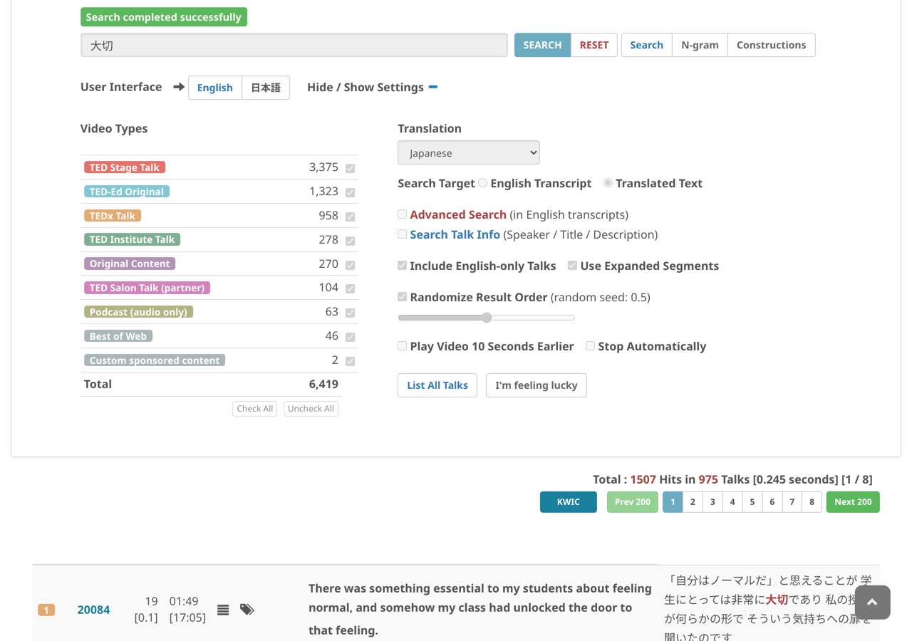

# Search in translation

1. Input a search string in your language
2. Set **Translation** to your language
3. Set **Search Target** to **Translated Text**
4. Click on **SEARCH**

This mode searches through the translated text and displays the corresponding English segments alongside the matching translation.
