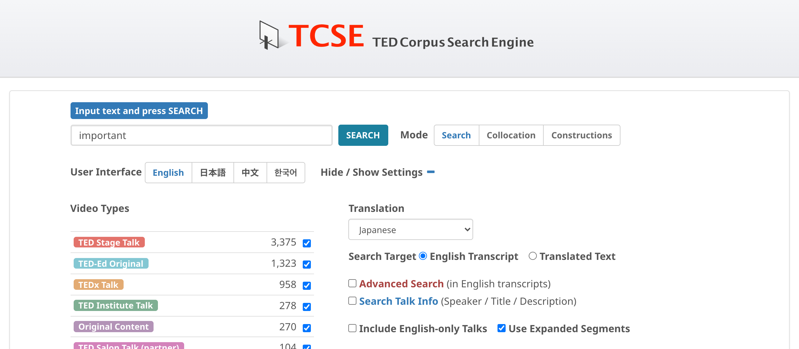
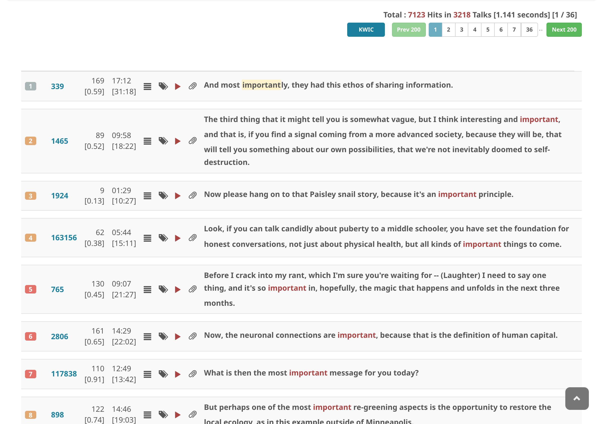

# Show translation

1. Input a search string
2. Choose a **Translation** language from the dropdown
3. Make sure **Search Target** is set to **English Transcript**
4. Uncheck **Include English only talks** to limit results to talks that have been translated in your chosen language
5. Click on **SEARCH**

The translated text will appear alongside each English search result.

TCSE supports translations in the following 34 languages:

Arabic, Bulgarian, Burmese, Chinese (Simplified), Chinese (Traditional), Croatian, Czech, Dutch, French, German, Greek, Hebrew, Hindi, Hungarian, Indonesian, Italian, Japanese, Korean, Kurdish (Central), Kurdish (Northern), Persian, Polish, Portuguese, Portuguese (Brazilian), Romanian, Russian, Serbian, Slovak, Spanish, Swedish, Thai, Turkish, Ukrainian, and Vietnamese.

Note that not all talks have translations in every language. The number of available talks varies by language.
