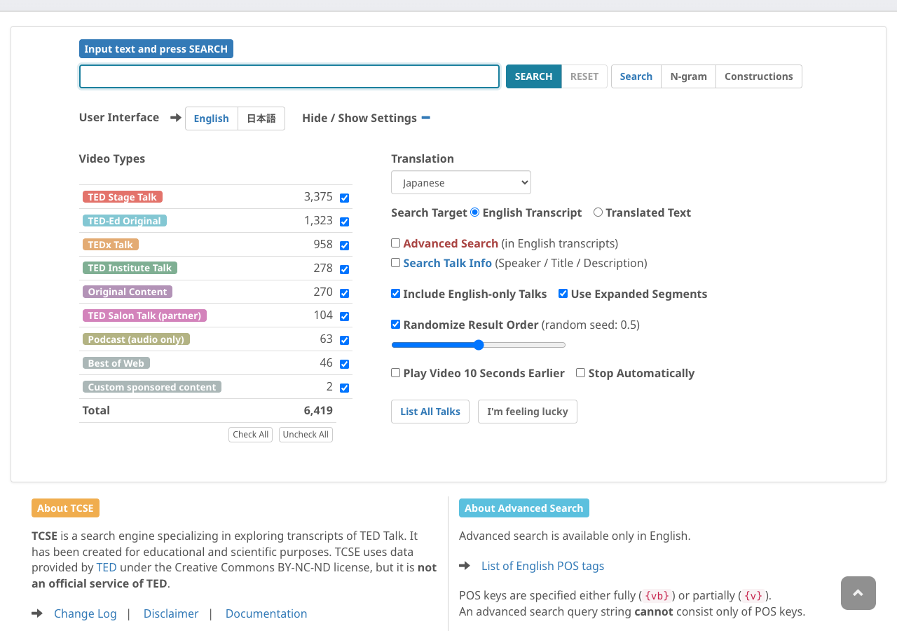

# ビデオタイプフィルタ

TCSEでは、ビデオタイプ（TED、TEDx、TED-Ed など）で検索結果を絞り込むことができます。

## 使い方

設定パネルの **Video Types** チェックボックスで、検索結果に含めるタイプを選択・解除できます。各タイプの横に、そのタイプに該当するトーク数が表示されます。

- **Check All**: すべてのビデオタイプを選択
- **Uncheck All**: すべてのビデオタイプの選択を解除

## ヒント

- デフォルトではすべてのビデオタイプが選択されている
- ビデオタイプによるフィルタリングは、すべての検索モード（通常検索、アドバンスト・サーチ、トーク情報検索）に適用される
- フィルタに一致するトークの合計数が結果に表示される
