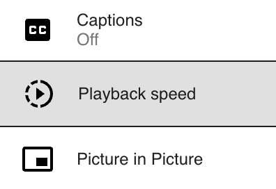
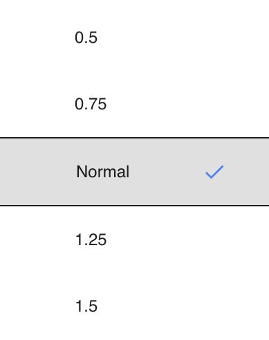

# Change play speed

TCSE uses an HTML5 `<video>` player that supports native playback speed control.

Select one of the available speed options from the `Play speed` dropdown in the configuration panel before making a search:

- 0.5x (half speed)
- 0.75x
- 1.0x (normal speed)
- 1.25x
- 1.5x
- 2.0x (double speed)

Slower speeds are useful for listening practice with difficult content, while faster speeds help advanced learners improve their processing speed.

{ width="150" }

{ width="150" }
