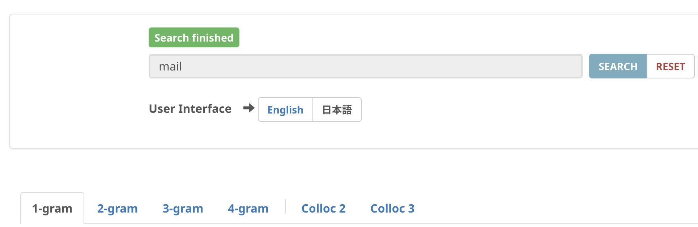
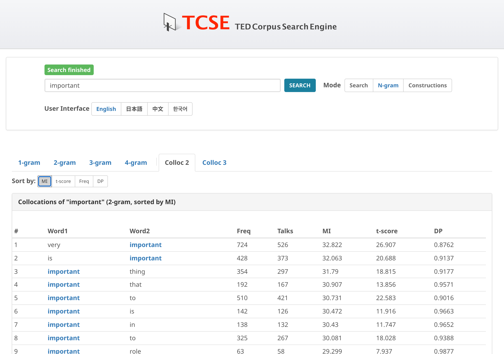

# コロケーション分析

コロケーション分析では、検索語と頻繁に共起する語を調べられます。

## アクセス方法

1. **Collocation** をクリックしてコロケーションモードに切り替える
2. 検索語を入力する
3. **Colloc 2** または **Colloc 3** タブをクリックする

- **Colloc 2**: 2語のコロケーション（検索語を含むバイグラム）を表示
- **Colloc 3**: 3語のコロケーション（検索語を含むトライグラム）を表示

## ソートオプション

コロケーション結果は、さまざまな統計的指標でソートできます：

| 指標 | 説明 |
| :--- | :--- |
| **MI**（相互情報量） | 2つの語がどの程度強く結びついているかを測定する。値が高いほど、特定性の高い強いコロケーションを示す。 |
| **t-score** | 結びつきの強さと頻度のバランスをとる指標。頻度が高く信頼性のあるコロケーションを見つけやすい。 |
| **Freq**（頻度） | 単純な共起頻度数。 |
| **DP**（deviation of proportions） | 分散（dispersion）の指標（Gries 2008）で、0 から 1 の値をとる。ペアの出現がトーク全体にどう散らばっているかを、各トークの長さと比べる。0 に近いほどトークの長さに比例して散らばっており、1 に近いほど少数のトークに集中している。2語の結びつきの強さを測る指標ではない。DP でソートすると、集中しているペアが上に来る。 |

## レンマベースの集約

コロケーション結果は**レンマ（基本形）ごとに集約**されるので、ペアの活用形が1つのエントリにまとまります。Colloc 2 で *make* を検索すると、たとえば次の行が得られます。

- *make + mistake* — *make mistakes* / *makes mistakes* / *made mistakes* / *making mistakes* を統合
- *make + decision* — 同じ2語の活用形を統合

各ペアに表示される頻度は、これらの語形にわたる合計です。レンマにマウスオーバーすると、集約された表層形が確認できます。行をクリックすると、レンマ検索構文を使ってすべての用例を検索します。

Colloc 2 が数えるのは**隣接する**2語なので、*make a mistake* は *make + mistake* には含まれません。間に冠詞が入るため、この表現は Colloc 3 の背後にある3語の系列に入ります。

### 表示される数値が指すもの

- 集約の対象になるのはコーパスの n-gram の行で、語・レンマ・品詞の組み合わせごとに1行あります。同じ表記でも複数行に分かれることがあります。
- 行が集約に入るのは、2つ以上のトークで3回以上出現する場合だけです。この条件は集約の前に適用されるため、**Freq** はこの条件を満たした行の合計であり、すべての行の合計ではありません。
- **Talks** は集約された行のうち最大のトーク数であり、いずれかの行を含むトークの異なり数ではありません。実際の異なり数より小さくなることがあります。
- 一覧は、頻度上位500件の候補を取り出し、選んだ指標で並べ替えて、最大100件を表示します。したがってコーパス全体を MI・t-score・DP で並べた上位ではありません。
- 集約された行の **DP** は、集約対象の行の DP の単純平均です。頻度による重み付けはせず、統合後の分布から計算し直した値でもありません。
- 集約は検索語の照合の**後**に行われます。そのため *makes* のような活用形を入力すると、*makes* に一致した行だけが集約されます。すべての語形を見るには基本形を入力してください。

## コロケーション・ネットワーク

コロケーション関係の視覚的な概観を得るには、**Network** タブを使用してください。詳しくは[コロケーション・ネットワーク](collocation-network.md)を参照してください。

!!! tip "ヒント"
    - MIスコアは出現頻度が低いが強く結びついた組み合わせを見つけやすい
    - t-scoreは学習者に役立つ、頻度が高く信頼性のあるコロケーションの発見に適している
    - 異なるソートオプションを試すと、語の組み合わせに関するさまざまな視点が得られる
    - コロケーションをクリックすると、トランスクリプトコーパス内でのその用例を検索できる
    - レンマのセルにマウスオーバーすると、集約されたすべての表層形を確認できる
