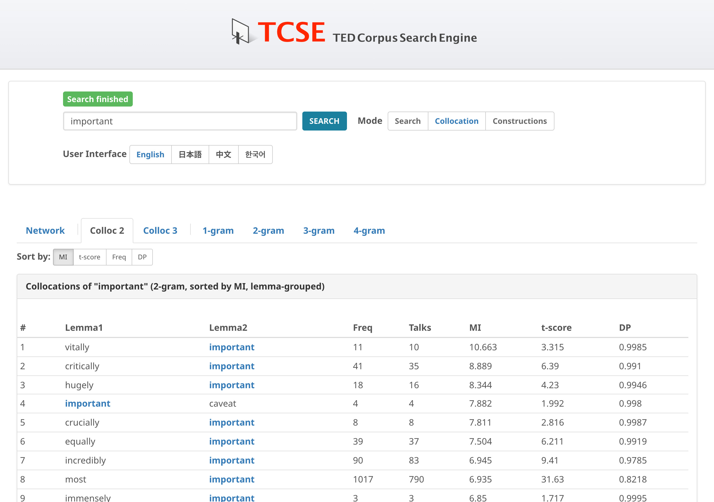
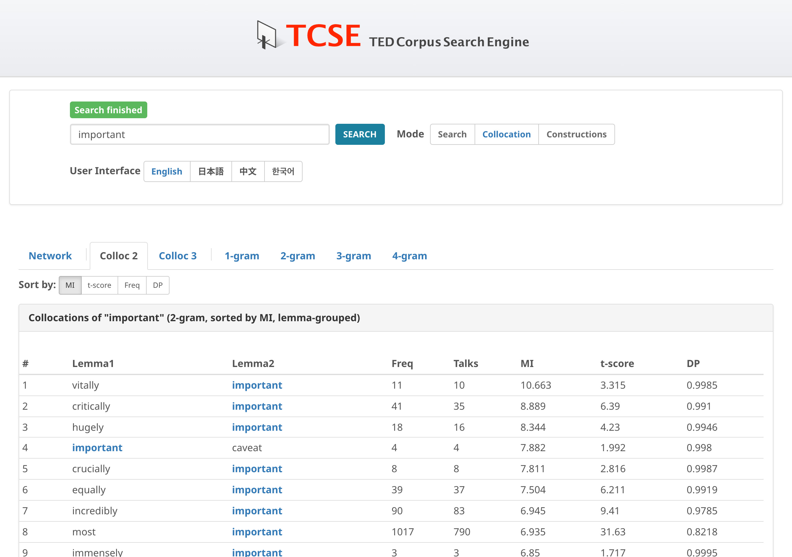

# Collocation analysis

TCSE provides collocation analysis to help you discover which words frequently co-occur with your search term. This is valuable for understanding natural word combinations and improving vocabulary knowledge.

## How to access

1. Click on **Collocation** to switch to Collocation mode
2. Enter a search word
3. Click on the **Colloc 2** or **Colloc 3** tab

- **Colloc 2**: Shows 2-word collocations (bigrams containing your search term)
- **Colloc 3**: Shows 3-word collocations (trigrams containing your search term)

## Sort options

You can sort collocation results by different statistical measures:

| Measure | Description |
| :--- | :--- |
| **MI** (Mutual Information) | Measures how strongly two words are associated. Higher values indicate stronger, often more specific collocations. |
| **t-score** | Balances association strength with frequency. Tends to highlight frequent, reliable collocations. |
| **Freq** (Frequency) | Simple co-occurrence frequency count. |
| **DP** (Delta P) | Directional association measure. Shows how much more likely word B is given word A, compared to its overall probability. |

## Lemma-based grouping

Collocation results are **grouped by lemma** (base form). This means that all inflected forms of a word are combined into a single entry. For example, searching for "make" will show:

- "make + mistake" (freq=109) — combining "make a mistake", "makes mistakes", "made a mistake", etc.
- "make + decision" (freq=218) — combining all forms

This gives a more accurate picture of the true collocational strength between words. Hover over a lemma to see all the surface forms that were aggregated. Click on a row to search for all instances using lemma search syntax.

## Collocation network

For a visual overview of collocational relationships, use the **Network** tab. See [Collocation Network](collocation-network.md) for details.

!!! tip "Tips"
    - MI scores tend to highlight rare but strongly associated pairs
    - t-scores are better for finding common, reliable collocations useful for learners
    - Try different sort options to get different perspectives on word combinations
    - Click on any collocation to search for its instances in the transcript corpus
    - Hover over a lemma cell to see all surface form variants
