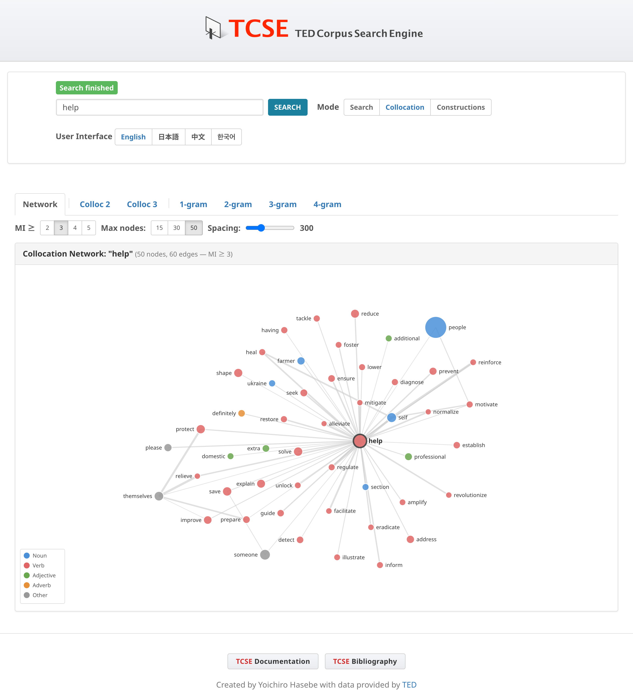

# コロケーション・ネットワーク

コロケーションモードの **Network** タブでは、語の共起関係をフォースレイアウトグラフで視覚的に表示します。検索語を入力すると、十分なコロケーションデータがある場合はNetworkタブがデフォルトで表示されます。データが不足している場合は自動的に2-gramタブに切り替わります。

## アクセス方法

1. **Collocation** をクリックしてコロケーションモードに切り替える
2. 検索語を入力して **Search** をクリックする
3. **Network** タブがデフォルトで選択される

## グラフの見方

- **ノード** はレンマ（語の基本形）を表します。例えば "makes" で検索すると、レンマ "make" が表示され、すべての活用形（make, makes, made, making）が集約されます。
- **エッジ**（線）は、コーパス内で頻繁に共起する語同士を結びます。太い線ほどMI（相互情報量）スコアが高いことを示します。
- **ノードの大きさ** は、その語のコーパス全体での頻度を反映します。
- **ノードの色** は品詞を示します：

| 色 | 品詞 |
| :--- | :--- |
| 青 | 名詞 |
| 赤 | 動詞 |
| 緑 | 形容詞 |
| オレンジ | 副詞 |
| グレー | その他 |

## コントロール

### MI閾値

**MI ≥** ボタン（2, 3, 4, 5）で、エッジを表示するための最小MI値を設定します。閾値を上げると、最も強いコロケーションのみが表示されます。デフォルトのMI ≥ 3で5ノード未満の場合、システムは自動的にMI ≥ 2に下げて再試行します。

### 最大ノード数

**Max nodes** ボタン（15, 30, 50）で、グラフに表示する最大語数を設定します。ノード数を減らすと、より焦点の絞られた見やすいグラフになります。

### ノード間隔（Spacing）

**Spacing** スライダー（100〜800）で、ノード間の反発力を調整します。値を大きくするとノードが広がり、ラベルの重なりを軽減できます。値を小さくするとコンパクトなグラフになります。

### ズーム

**Zoom** スライダー（50%〜200%）でグラフの拡大・縮小を調整します。スライダーをドラッグして倍率を変更してください。現在のズーム率はスライダーの横に表示されます。

## インタラクション

- **パン**: 背景をドラッグしてグラフ全体を移動
- **ドラッグ**: 個別のノードをドラッグしてレイアウトを調整
- ノードに**マウスオーバー**すると、接続先がハイライトされ、エッジのMIスコアが表示されます
- **中心ノードをクリック**（検索語）：`[lemma]` のトークン検索に遷移し、コーパス内の全用例を表示
- **周辺ノードをクリック**：2語間の共起パターン（2〜4gram）を頻度順に表示するモーダルが開きます。パターン行をクリックすると、その具体的な用例をコーパスから検索できます

## フィルタリング基準

ネットワークでは、意味のあるコロケーションを選択するために以下のフィルタを適用しています：

- **MI閾値**: 最小相互情報量スコア（デフォルト ≥ 3、自動的に ≥ 2にフォールバック）
- **頻度**: 最小共起頻度 ≥ 3
- **トーク数**: 最小トーク数 ≥ 3 — コロケーションが少なくとも3つの異なるTED Talkに出現する必要があります

トーク数フィルタは、TEDコーパスの文書レベルの構造を活用しています。各トークは異なる話者による独立した談話イベントであるため、複数のトークにわたって確認されるコロケーションは、単一のトークに集中するものよりも、真の言語的結びつきの強い証拠を提供します。

### ストップワード

以下のカテゴリの機能語は、コロケーション相手（周辺ノード）としてネットワークから除外されます（ただし、中心語として検索することは可能です）：

- 冠詞: *the, a, an*
- be動詞: *is, was, are, were, be, been, being*
- 前置詞: *of, in, to, for, on, with, at, by, from, about, into, over, after, before, between, through, during*
- 接続詞: *and, or, but, if, so, than*
- 否定辞: *not*
- 助動詞: *has, have, had, do, does, did, will, would, can, could, may, might, shall, should, must*
- 代名詞: *it, its, this, that, there, their, they, them, he, she, him, her, his, we, our, you, your, who, which, what, how*
- 数量詞・限定詞: *all, some, no, any, each, every, much, many, more, most, such, only*
- 数詞: *one* 〜 *ten*、*first, second, third, last, next*
- 高頻度副詞: *also, just, even, still, back, up, out, then, too, when, where, here*

内容語（名詞、動詞、形容詞、大部分の副詞）は、談話レベルで意味のあるコロケーションを形成する可能性があるため、**除外されません**。

## レンマベースの集約

ネットワークでは**レンマベースの集約**を使用しています。同一語の活用形はすべて1つのノードにまとめられます。例：

- "make", "makes", "made", "making" → 1つのノード "make"
- "great", "greater", "greatest" → 1つのノード "great"

これにより、関連する語形を統合し、すべての表層形にわたるコロケーション関係の真の強度を示す、より明確で意味のあるネットワークが生成されます。

!!! tip "ヒント"
    - 内容語（名詞、動詞、形容詞）で検索すると、最も情報量の多いネットワークが得られる
    - Spacingスライダーでラベルの重なりを軽減し、Zoomスライダーで拡大・縮小を調整できる
    - 周辺ノードをクリックして共起パターンを確認し、パターン行をクリックしてコーパス内の実例を探索できる
    - ネットワークはCollocタブを補完し、語のコロケーション・プロファイルの視覚的な概観を提供する
