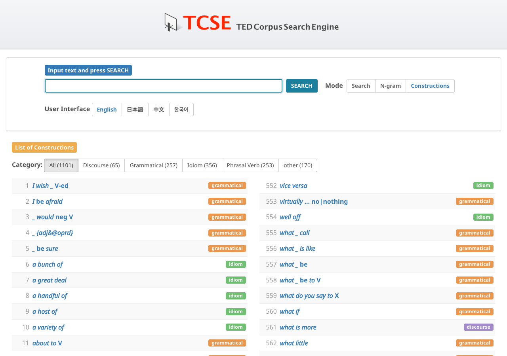
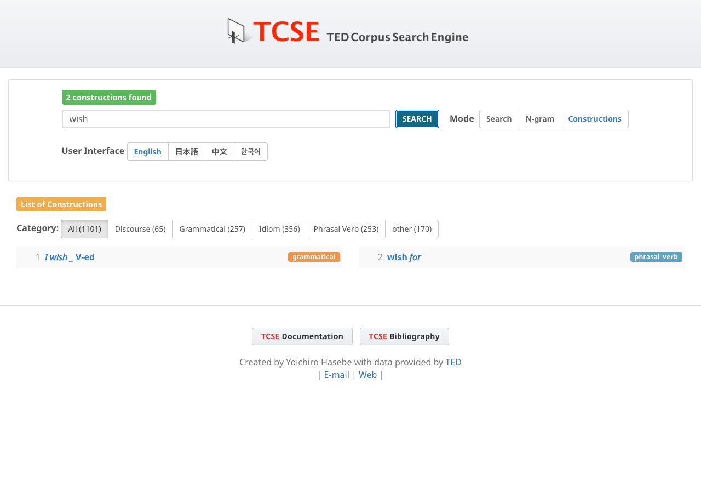
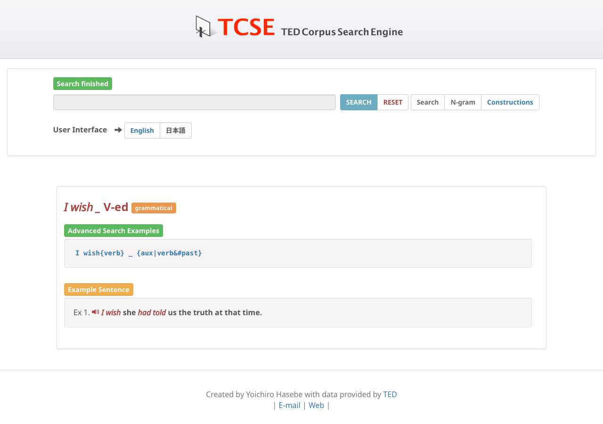
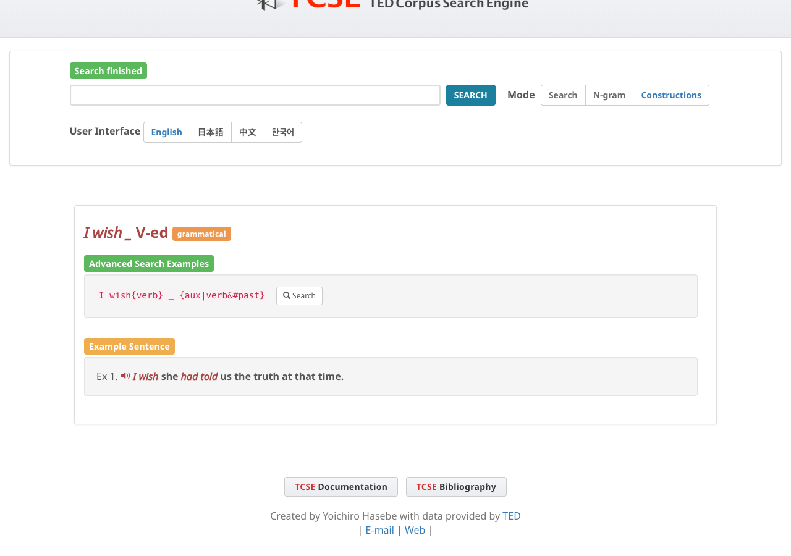

# 構文・熟語

ナビゲーションバーで **Constructions** をクリックして、構文・熟語モードに切り替えてください。

TCSEデータベースには、複数の用例を持つ **1,156件の構文・熟語** が収録されています。構文文法（Construction Grammar; Goldberg 1995, 2006）に基づき、完全に固定された表現から部分的にスキーマ的なパターンまでの連続体を6つのカテゴリでカバーしています。英語の学習者と教育者、および言語研究者にとって有用なリストです。

## カテゴリフィルタ

構文は6つのカテゴリに分類されています。上部のカテゴリフィルタボタンを使って、特定のタイプの構文だけを表示できます：

- **Collocation**: 動詞＋前置詞、形容詞＋前置詞パターン（例: "accuse \_ of", "afraid of"）
- **Discourse**: 談話標識・接続表現（例: "as a matter of fact", "as a result"）
- **Grammatical**: 基礎文法パターン（例: "the more ... the more ...", "there be", 比較級/最上級, 受動態）
- **Idiom**: イディオム表現（例: "at the end of the day", "each other"）
- **NER Pattern**: 固有表現スロット構文 — 特定タイプの固有表現が意味的スロットを埋めるパターン（例: "in %GPE" は場所名、"%PERSON said" は人名）。言語構造と固有表現認識を組み合わせることで、前置詞・動詞・統語構造と意味カテゴリの相互作用を可視化します。
- **Phrasal verb**: 句動詞（例: "give up", "look into"）

## テキストフィルタ

上部の検索ボックスを使って、キーワードで構文を絞り込むことができます。単語やフレーズを入力して **SEARCH**（またはEnter）を押すと、説明文にそのテキストを含む構文だけが表示されます。カテゴリボタンとの併用も可能です — 先にカテゴリを選択してから、その中でフィルタリングできます。

マッチした構文の数はステータスバーに表示されます。**CLEAR** を押すとフィルタがリセットされ、すべての構文が再表示されます。

## 構文の詳細

各構文にはコーパス内での用例を検索するリンクと、例文が付いています。例文はTED Talkからの引用ではなく、新しく作成されたものです。（例文は非商用目的で自由に使用できますが、著作権はTCSEの開発者が保持しています。）

## 音声読み上げ

各例文の左にスピーカーアイコン（🔊）があります。クリックすると、ブラウザ内蔵の音声合成機能（Web Speech API）を使って例文が読み上げられます。聞き取りやすいよう、やや遅めの速度（0.85倍速）で再生されます。再生中にもう一度アイコンをクリックすると停止します。

!!! note "注意"
    音声読み上げの利用可否はブラウザとOSに依存します。多くのモダンブラウザ（Chrome、Safari、Edge、Firefox）で動作しますが、すべての環境で利用できるとは限りません。
