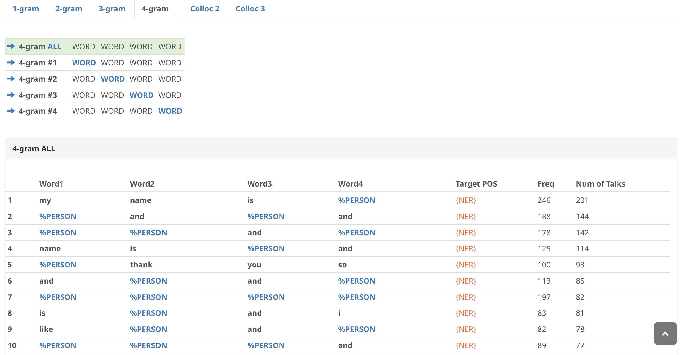

# Nグラム

TED Talk の語句のNグラムを確認できます。メインページの **N-gram** ボタンをクリックして、Nグラムモードに切り替えてください。

{ width="600" }

Nグラムとは、*n* 個の連続する語のまとまりを指します。さまざまなNグラムの頻度を確認することで、その言語において定着している語の連なりや、そうでないものを見出すことができます。

## Nグラムのタブ

TCSEでは4種類のNグラムサイズが利用可能です：

- **1-gram**: 単語単位の頻度
- **2-gram**: 2語連続（バイグラム）
- **3-gram**: 3語連続（トライグラム）
- **4-gram**: 4語連続

検索キー *wait* に対する出力例：

## 位置フィルタボタン

Nグラムの結果が表示されると、結果テーブルの上にフィルタボタンが表示されます：

- **n-gram ALL**: 検索語がどの位置にあるかを問わず、すべてのNグラムを表示（デフォルト）
- **n-gram #1**: 検索語が1番目の位置にあるNグラムのみ表示
- **n-gram #2**: 検索語が2番目の位置にあるNグラムのみ表示
- （以降、#nまで同様）

例えば、2-gramモードで *wait* を検索した場合、**#1** をクリックすると *wait* が先頭にくるNグラム（例：*wait for*、*wait until*）が、**#2** をクリックすると *wait* が2番目にくるNグラム（例：*can't wait*、*please wait*）が表示されます。

## チャンクベースのNグラム

結果テーブルでは、一部の行が**水色の背景**で表示されます。これらは**名詞句チャンク**を表しています。名詞句チャンクとは、複数の語が1つの文法単位として機能するまとまり（例：*immune system*、*solar system*）のことです。水色の背景がない行は、単純な語単位のNグラムです。

このチャンクベースの分析により、単純な語の連なりを超えた、意味のある複数語表現を特定できます。結果の任意の行をクリックすると、トランスクリプトコーパス内でのその用例を検索できます。

## コロケーション分析

**Colloc 2** と **Colloc 3** タブでは、検索語のコロケーション分析を提供しています。詳しくは[コロケーション分析](collocation-analysis.md)を参照してください。

!!! tip "ヒント"
    - 結果に表示されたNグラムをクリックすると、トランスクリプトコーパス内でのその用例を検索できる
    - Nグラム頻度はTED Talkにおける実際の使用パターンを反映している
