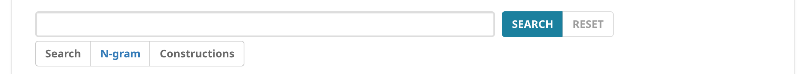
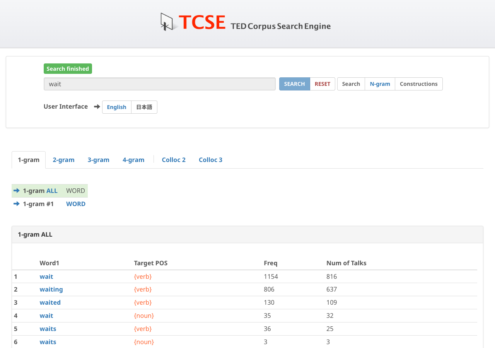
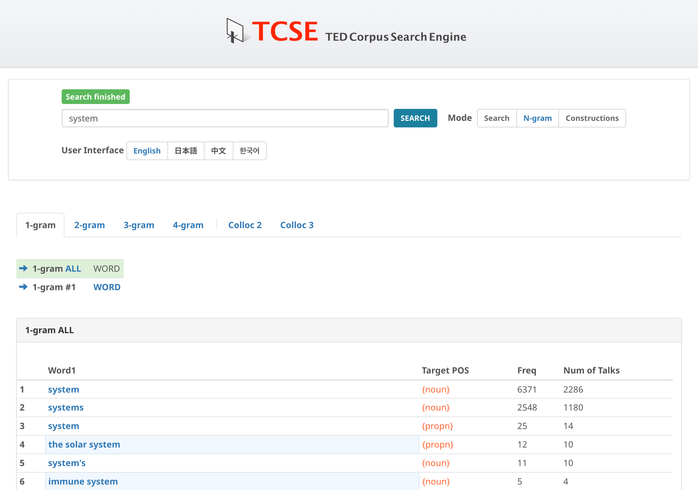

# N-grams

You can look at n-grams of words in TED Talks. Click on the **N-gram** button on the main page to switch to N-gram mode.

{ width="600" }

An n-gram is a sequence of words of *n* items. Looking at frequencies of various n-grams, you can find out what linguistic sequences are more entrenched in the language and, possibly, what are less so.

## N-gram tabs

TCSE offers four n-gram sizes:

- **1-gram**: Single word frequencies
- **2-gram**: Two-word sequences (bigrams)
- **3-gram**: Three-word sequences (trigrams)
- **4-gram**: Four-word sequences

Here is a sample output returned in response to the search key *wait*:

## Position filter buttons

When n-gram results are displayed, you will see a set of filter buttons above the results table:

- **n-gram ALL**: Shows all n-grams containing the search term in any position (default)
- **n-gram #1**: Shows only n-grams where the search term appears in position 1
- **n-gram #2**: Shows only n-grams where the search term appears in position 2
- (and so on, up to #n)

For example, when searching for *wait* in 2-gram mode, clicking **#1** shows n-grams where *wait* comes first (e.g., *wait for*, *wait until*), while **#2** shows n-grams where *wait* comes second (e.g., *can't wait*, *please wait*).

## Chunk-based n-grams

In the results table, some rows are displayed with a **light blue background**. These represent **noun phrase chunks** — multi-word units that function as a single grammatical unit (e.g., *immune system*, *solar system*). Rows without the light blue background are simple word-level n-grams.

This chunk-based analysis helps you identify meaningful multi-word expressions beyond simple word sequences. Click on any row to search for its instances in the transcript corpus.

## Collocation analysis

The **Colloc 2** and **Colloc 3** tabs provide collocation analysis for your search term. See [Collocation analysis](collocation-analysis.md) for details.

!!! tip "Tips"
    - Click on any n-gram in the results to search for its instances in the transcript corpus
    - N-gram frequencies reflect actual usage patterns in TED Talks
