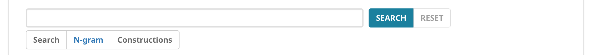
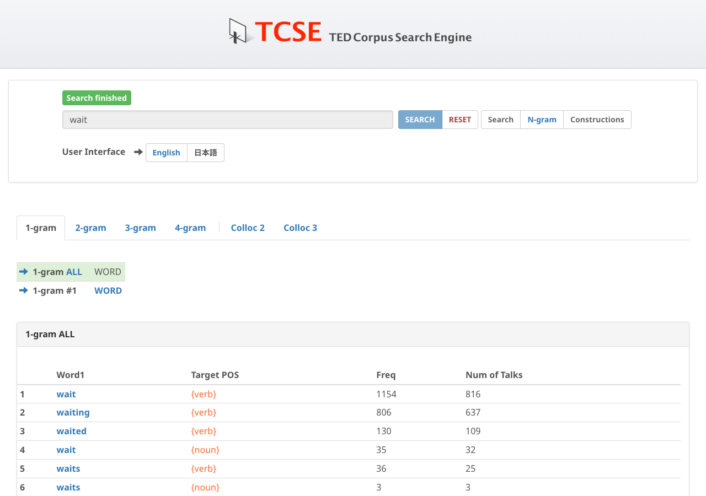
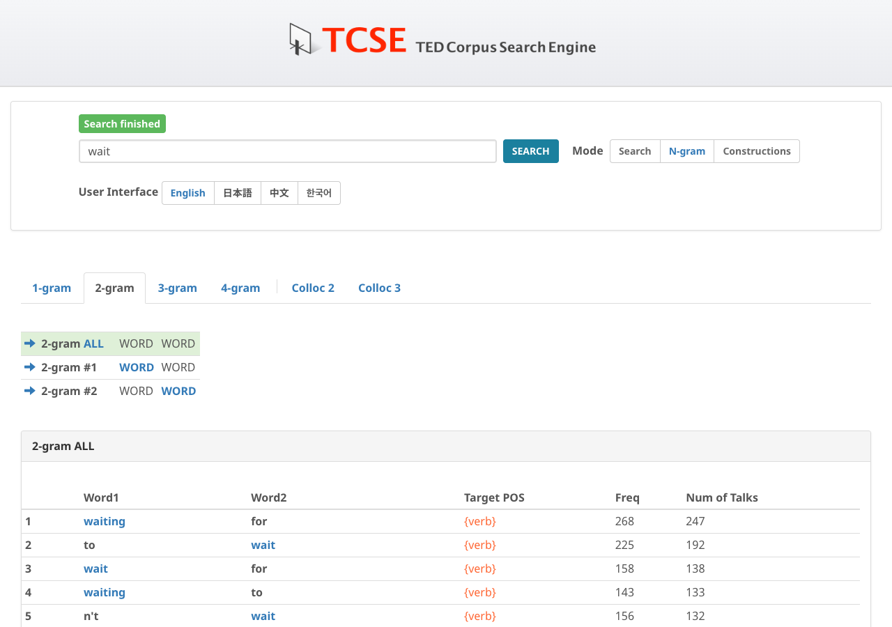
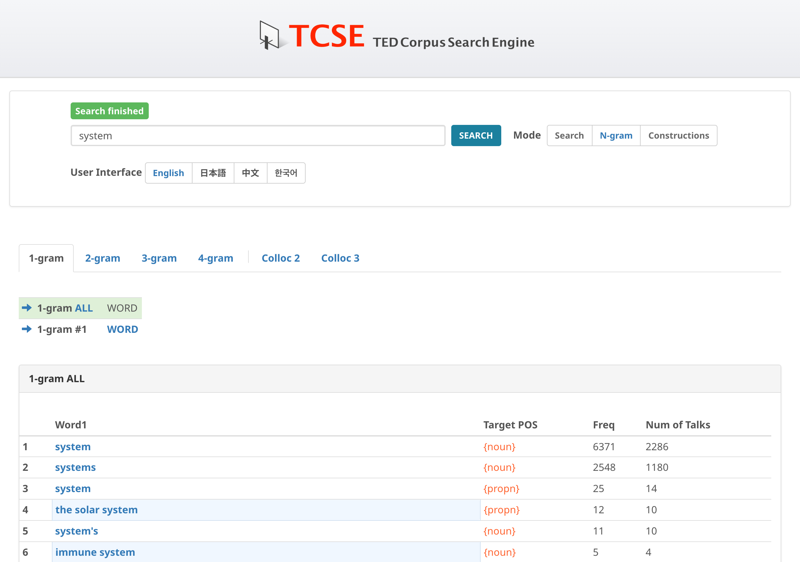

# N-grams

You can look at n-grams of words in TED Talks. Click on the **Collocation** button on the main page to switch to Collocation mode.

{ width="600" }

An n-gram is a sequence of *n* consecutive items. Looking at the frequencies of n-grams tells you which sequences are well established in the language and which are not. In these tabs an item is a chunk rather than a word; the next section says what that changes.

## N-gram tabs

TCSE offers four n-gram sizes:

- **1-gram**: Frequencies of single items
- **2-gram**: Sequences of two items (bigrams)
- **3-gram**: Sequences of three items (trigrams)
- **4-gram**: Sequences of four items

Here *n* counts **items, not words**. A noun phrase chunk counts as one item, so a 1-gram can be several words long — *the united states* and *new york* both appear in the 1-gram table. This is why some rows in the results are wider than *n* words; see [Chunk-based n-grams](#chunk-based-n-grams) below.

The **Colloc** and **Network** tabs use a separate word-level series in which every item is a single word. Because the two series count different units, the frequency of the same string can differ between them.

Here is a sample output returned in response to the search key *wait*:

## Position filter buttons

When n-gram results are displayed, you will see a set of filter buttons above the results table:

- **n-gram ALL**: Shows all n-grams containing the search term in any position (default)
- **n-gram #1**: Shows only n-grams where the search term appears in position 1
- **n-gram #2**: Shows only n-grams where the search term appears in position 2
- (and so on, up to #n)

For example, when searching for *wait* in 2-gram mode, clicking **#1** shows n-grams where *wait* comes first (e.g., *wait for*, *wait until*), while **#2** shows n-grams where *wait* comes second (e.g., *can't wait*, *please wait*).

## Chunk-based n-grams

In the results table, some rows are displayed with a **light blue background**. These represent **noun phrase chunks** — multi-word units that function as a single grammatical unit (e.g., *immune system*, *solar system*). Rows without the light blue background are simple word-level n-grams.

This chunk-based analysis helps you identify meaningful multi-word expressions beyond simple word sequences. Click on any row to search for its instances in the transcript corpus.

## NER-enhanced n-grams

When you search for a named entity type (e.g., `%PERSON`, `%GPE`, `%ORG`), the n-gram tables display results where actual named entities are replaced with their type labels. For example, searching `%PERSON` in 2-gram mode might show entries like `%PERSON said` or `thank %PERSON`, revealing how different entity types interact with surrounding linguistic structures regardless of the specific entity name.

## Collocation analysis

The **Colloc 2** and **Colloc 3** tabs provide collocation analysis for your search term, with results grouped by lemma for accurate association measures. See [Collocation analysis](collocation-analysis.md) for details.

## Collocation network

The **Network** tab provides an interactive force-directed graph visualization of collocational relationships. See [Collocation Network](collocation-network.md) for details.

!!! tip "Tips"
    - Click on any n-gram in the results to search for its instances in the transcript corpus
    - N-gram frequencies reflect actual usage patterns in TED Talks
    - The Colloc and Network tabs use lemma-based aggregation to combine inflected forms
