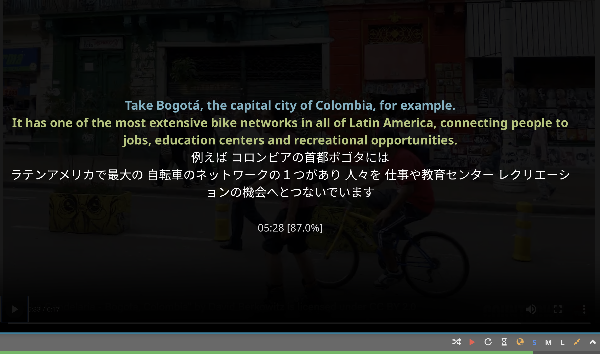

# Using pause-and-check

Listening ability does not improve if you keep reading the transcript all the time. But without a transcript, it can be difficult to follow the talk and grasp the speaker's message. This is especially the case for learners at elementary and intermediate levels. The "pause-and-check" functionality of TCSE offers the best of both worlds.

In fullscreen viewing mode, the transcript and its translation text are shown **only when the video is paused**, so you can concentrate on listening instead of reading text on the screen. When there's anything unclear or difficult to understand, simply pause and check the transcript.

To use this feature:

1. Start playing a video
2. Switch to [fullscreen mode](../playing-video/switch-to-fullscreen.md) (press `ESC`, `E`, or `B`)
3. Enable [Study Mode](../playing-video/pause-video-after-segment.md) (press `A`) for auto-pausing after each segment

